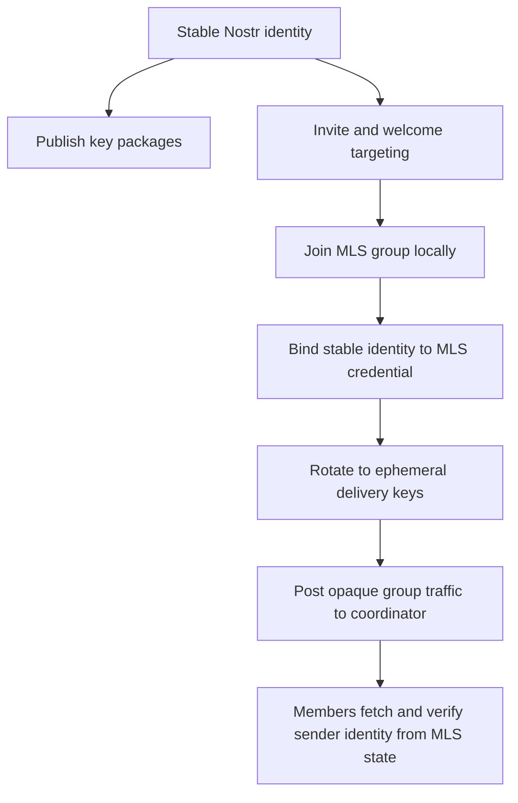
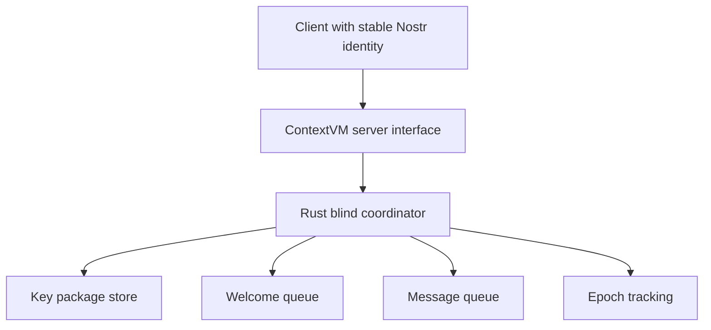

# ContextVM MLS Delivery Service MVP Design

## Status

`draft` `architectural`

## Goal

Define a simple, elegant MVP for an MLS delivery service exposed through ContextVM, using Nostr identities for discovery and attribution while minimizing what the coordinator can learn about senders and group relationships.

## Design Summary

The MVP should combine four ideas:

- **OpenMLS DS simplicity** from [`openmls/delivery-service/ds/src/main.rs`](../openmls/delivery-service/ds/src/main.rs:1)
- **Nostr identity and discoverability** inspired by Marmot, especially group metadata ideas from [`marmot/01.md`](../marmot/01.md:1)
- **Blind delivery-service semantics** described in [`mls-ds.md`](../mls-ds.md)
- **ContextVM transport exposure** using a server pattern consistent with [`server-dev`](../.roo/skills/server-dev/SKILL.md)

The core architectural decision is to separate the system into two privacy domains:

- **Identity and invitation domain** using stable Nostr public keys
- **Post-welcome delivery domain** using ephemeral delivery public keys

This avoids using public-relay transport for all MLS traffic, which is one of the main concerns identified in [`marmot-viability.md`](../marmot-viability.md).

## Problem Statement

The system needs to support real MLS text messaging with:

- key package publication
- welcome delivery
- group routing
- epoch tracking
- message queueing and fetch
- user-visible sender attribution

At the same time, the coordinator should learn as little as possible.

The MVP should therefore avoid:

- durable transport linkage between long-term Nostr identities and post-welcome group traffic
- rich server-side membership modeling when not strictly necessary
- heavy RPC surfaces modeled after full delivery platforms such as [`hermetic-mls/proto/mls_service.proto`](../hermetic-mls/proto/mls_service.proto:1)

## Architectural Principles

### 1. Stable identity is for discovery, not routine delivery

Stable Nostr public keys should be used for:

- publishing key packages
- discovering invite targets
- associating MLS credentials with human-recognizable identities
- locating welcome material for newly invited users

Stable Nostr public keys should **not** be required for ordinary post-welcome message submission.

### 2. Post-welcome transport should be unlinkable by default

After a member joins a group, ordinary traffic should be sent through ephemeral delivery keys.

This means the coordinator sees:

- group routing metadata
- epoch-related metadata
- opaque message blobs
- short-lived delivery sender keys

But the coordinator should not automatically learn:

- which stable Nostr identity authored a message
- durable sender history across groups
- a complete social graph of group membership

### 3. Sender attribution belongs in MLS-authenticated identity, not transport

Users still need messages to appear as authored by stable identities.

That attribution should come from MLS credentials or authenticated group state, not from the coordinator-facing envelope.

This implies:

- stable Nostr pubkey is bound to MLS credential semantics
- recipients verify author identity from MLS-authenticated data
- coordinator transport metadata is not trusted for authorship

### 4. Coordinator should stay blind and small

The coordinator should behave much more like the OpenMLS DS in [`openmls/delivery-service/ds/src/main.rs`](../openmls/delivery-service/ds/src/main.rs:1) than the richer service in [`hermetic-mls/README.md`](../hermetic-mls/README.md).

It should only manage what is needed for delivery:

- published key packages
- welcome queues
- queued group messages
- minimal group and epoch routing state

## Privacy Domains

### Identity and invitation plane

This plane uses stable public identity.

Responsibilities:

- publish key packages under stable Nostr identity
- discover recipients by stable identity
- target welcome delivery to a stable discoverable identifier
- optionally show stable user profile information in clients

This leaks some relationship metadata during the invitation and onboarding stage, but keeps the user experience straightforward.

### Delivery plane

This plane uses ephemeral transport identity.

Responsibilities:

- post proposal, commit, and application traffic after join
- fetch queued messages
- move group traffic without revealing stable author identity to the coordinator

This reduces long-term linkage after the welcome phase.

## What to Borrow and What to Avoid

### Borrow from Marmot

Borrow selectively from [`marmot/01.md`](../marmot/01.md:1):

- use stable Nostr identities as user-facing identifiers
- use simple credential mapping from stable identity to MLS member identity
- use a small subset of group metadata such as:
  - group name
  - group description

This metadata should live in authenticated MLS state, not in coordinator-controlled mutable records.

### Do not borrow from Marmot for MVP core

Avoid bringing in:

- public-relay-first delivery for all traffic
- relay agreement as a core group requirement
- broad transport coupling to Nostr event semantics
- advanced media or image metadata flows
- assumptions that public Nostr dissemination is the main coordination layer

### Borrow from OpenMLS DS

Use the OpenMLS DS as the main simplicity reference from [`openmls/delivery-service/ds/src/main.rs`](../openmls/delivery-service/ds/src/main.rs:1) and [`openmls/delivery-service/ds-lib/src/lib.rs`](../openmls/delivery-service/ds-lib/src/lib.rs:1):

- small API surface
- minimal coordinator state
- opaque message storage and forwarding
- limited epoch tracking
- no rich group object model required for the first cut

### Use Hermetic-MLS only as a trimming reference

[`hermetic-mls/proto/mls_service.proto`](../hermetic-mls/proto/mls_service.proto:1) is useful for understanding the broader operations a production-style service might expose, but it is too rich for the MVP baseline.

The MVP should not start with:

- explicit server-owned client lifecycle records
- durable membership tables as the primary truth source
- heavy server-managed group state
- detailed per-message semantic typing beyond what routing requires

## Coordinator Responsibilities

The MVP coordinator should support only the minimum required capabilities.

### Required responsibilities

- register published key packages under a stable Nostr identity
- fetch or consume key packages for invitations
- store and deliver welcome messages to invited users
- accept opaque group messages using ephemeral delivery keys
- queue messages for subscribers
- maintain minimal epoch state to reject stale handshake traffic

### Explicit non-goals for the MVP

- spam mitigation and abuse controls
- payments or quotas
- rich moderation tools
- complex relay policy modeling
- durable rich social graph storage
- server-side interpretation of decrypted group semantics

## Minimal Data Model

The coordinator data model should remain intentionally small.

### Stable identity records

- `stable_pubkey`
- `published_key_packages`
- optional lightweight profile reference

### Group routing records

- `group_id`
- `latest_handshake_epoch`
- optional minimal delivery cursor state

### Welcome queue records

- `welcome_id`
- `target_stable_pubkey`
- `key_package_reference`
- `opaque_welcome_blob`
- `created_at`

### Message queue records

- `message_id`
- `group_id`
- `epoch`
- `message_class` such as application or handshake
- `ephemeral_sender_pubkey`
- `opaque_message_blob`
- `created_at`

This model intentionally avoids storing a durable mapping from `ephemeral_sender_pubkey` to `stable_pubkey`.

## Identity Model

The MVP identity model should be:

- stable Nostr pubkey for user identity and discoverability
- MLS credential binds member identity to that stable pubkey
- ephemeral delivery pubkey used only for transport-facing writes after join

This allows the recipient to render a message as authored by the stable identity while the coordinator only sees the ephemeral transport identity.

## Group Metadata Model

The MVP may borrow a minimal subset of Marmot-style metadata, but this metadata should be small and authenticated.

Recommended fields:

- `name`
- `description`

Avoid including relay lists or transport directives in the MVP group metadata.

The coordinator should not be the canonical owner of this metadata. The metadata should be derived from group state that members verify through MLS.

## MVP RPC Surface

The ContextVM server should expose a narrow tool surface.

### Identity and key package tools

- `publish_key_package`
- `list_key_packages_for_identity`
- `consume_key_package_for_identity`

### Welcome tools

- `store_welcome`
- `fetch_pending_welcomes`

### Group delivery tools

- `post_group_message`
- `fetch_group_messages`

### Optional minimal metadata tools

- `put_group_metadata`
- `get_group_metadata`

These metadata tools should only exist if they map directly to authenticated MLS group state handling rather than server-owned mutable group records.

## ContextVM Exposure

The coordinator should be exposed through a ContextVM server using the model described in [`server-dev`](../.roo/skills/server-dev/SKILL.md).

Recommended pattern:

- implement the coordinator core in Rust
- implement a thin ContextVM server interface that maps tool calls to coordinator operations
- keep ContextVM as the external transport and discovery interface, not as the place where coordinator semantics are embedded

That means the architecture becomes:

## Why This Is Simpler Than Marmot

This MVP reduces complexity because it does not ask public relays to be:

- the universal delivery channel
- the main coordination layer
- the long-term metadata surface for all group activity

Instead:

- Nostr remains useful for identity and discoverability
- ContextVM exposes the service over Nostr
- the coordinator handles queueing and serialization
- MLS continues to provide end-to-end security and authenticated sender semantics

## Why This Is Simpler Than Hermetic-MLS

This MVP is lighter than Hermetic-MLS because it does not start with:

- a full server-owned group lifecycle model
- a rich membership database
- a broad RPC contract
- a coordinator that knows too much about clients

The initial implementation should look much closer in spirit to the OpenMLS DS than to a production-grade MLS platform.

## Known Trade-offs

### What this improves

- reduces long-term sender linkage at the coordinator
- keeps stable Nostr identity for UX and discovery
- keeps the server simple
- aligns well with a blind MLS delivery-service model

### What this does not solve

- invitation and welcome targeting still reveal some relationship metadata
- coordinator still sees group activity timing and epoch movement
- no claim of strong metadata privacy should be made
- abuse prevention is intentionally out of scope for the MVP

## MVP Recommendation

Implement the first version with the following bias:

- **Marmot for identity ideas only**
- **OpenMLS DS for service shape and simplicity**
- **ContextVM for exposure over Nostr**
- **Hermetic-MLS only as a reference for future expansion**

## Implementation Direction

The implementation should proceed in this order:

1. Rust blind coordinator core
2. key package publish and consume flow
3. welcome storage and fetch flow
4. message queue and fetch flow with epoch tracking
5. stable identity to MLS credential mapping
6. ephemeral post-welcome delivery path
7. thin ContextVM server wrapper around the coordinator

## Final Position

The MVP should be a privacy-aware MLS delivery service, not a full Marmot transport implementation and not a full Hermetic-style platform.

The clean boundary is:

- stable Nostr identity for discovery and attribution
- ephemeral transport identity for post-welcome delivery
- blind coordinator for storage, queueing, and epoch checks
- ContextVM as the exposure layer over Nostr

That gives the project a design that is feasible, elegant, privacy-improving, and small enough to prototype without importing unnecessary protocol complexity.
