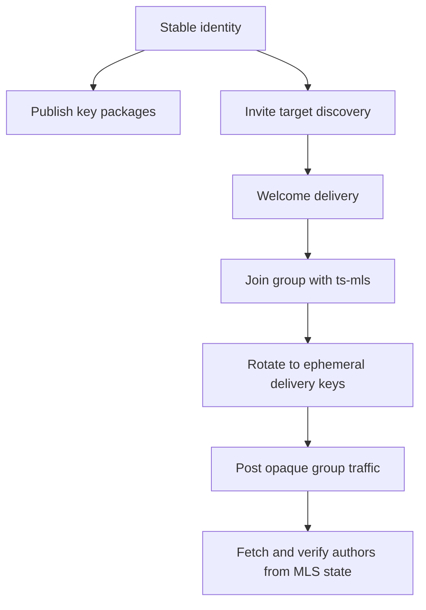
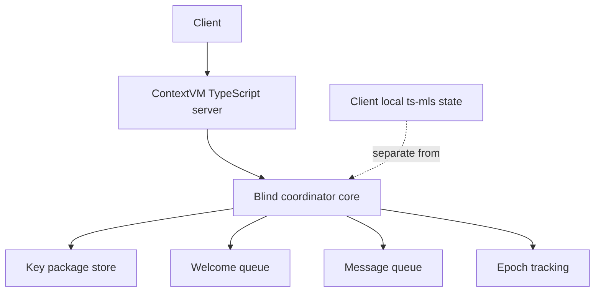

# ContextVM MLS Delivery Service MVP Design

## Status

`draft` `architectural` `typescript-first`

## Goal

Define a simple MVP for an MLS delivery service exposed through ContextVM, implemented entirely in TypeScript with [`ts-mls`](../ts-mls/README.md) and run with pnpm, while keeping the coordinator blind, queue-oriented, and small.

## Decision

The MVP should **not** use a split Rust delivery service plus TypeScript ContextVM bridge.

The MVP should instead be:

- one TypeScript codebase
- one ContextVM server
- one queue-oriented coordinator implementation
- one MLS implementation based on [`ts-mls`](../ts-mls/README.md)
- one runtime stack based on pnpm

This is the main architectural correction from the earlier direction.

## Why the Earlier Direction Became Too Complex

The failed path introduced an unnecessary internal boundary:

- Rust owned the delivery service logic
- TypeScript owned the ContextVM server layer
- both sides needed an explicit contract
- debugging required tracing across two implementations and two runtimes

That produced avoidable complexity in:

- API contract definition
- binary and message boundary debugging
- duplicated domain modeling
- slower iteration during MVP development

For this MVP, that split should be removed.

## Feasibility Assessment

Implementing the delivery service in TypeScript is feasible.

The reason is that [`ts-mls`](../ts-mls/README.md) already provides the MLS operations the clients need:

- key package generation in [`generateKeyPackage()`](../ts-mls/src/keyPackage.ts:184)
- key reuse for stable identity semantics in [`generateKeyPackageWithKey()`](../ts-mls/src/keyPackage.ts:135)
- group creation in [`createGroup()`](../ts-mls/src/clientState.ts:1124)
- join from welcome in [`joinGroup()`](../ts-mls/src/clientState.ts:921)
- commit generation in [`createCommitInternal()`](../ts-mls/src/createCommit.ts:89)
- application message generation in [`createApplicationMessage()`](../ts-mls/src/createMessage.ts:102)
- message processing in [`processMessage()`](../ts-mls/src/processMessages.ts:484)
- credential validation hooks through [`AuthenticationService`](../ts-mls/src/authenticationService.ts:4)
- full client state persistence via the serialization flow documented in [`ts-mls/docs/15-client-state-serialization.md`](../ts-mls/docs/15-client-state-serialization.md)

This means the coordinator does **not** need to implement MLS cryptography or group-state logic itself.

It only needs to provide delivery-service behavior.

## Core Design Summary

The MVP combines five ideas:

- **OpenMLS DS simplicity** from [`openmls/delivery-service/ds/src/main.rs`](../openmls/delivery-service/ds/src/main.rs:1)
- **TypeScript-only implementation** using [`ts-mls`](../ts-mls/README.md)
- **Blind coordinator semantics** described in [`mls-ds.md`](../mls-ds.md)
- **Stable identity plus ephemeral delivery separation** from the earlier privacy-first design
- **ContextVM exposure** using a direct TypeScript server rather than a bridge, consistent with [`server-dev`](../.agents/skills/server-dev/SKILL.md)

## Problem Statement

The system needs to support real MLS text messaging with:

- key package publication
- welcome delivery
- group routing
- epoch tracking
- message queueing and fetch
- user-visible sender attribution

At the same time, the coordinator should learn as little as possible and remain implementation-light.

The MVP should therefore avoid:

- a Rust and TypeScript split for core delivery behavior
- durable transport linkage between long-term identity and routine group traffic
- heavy server-side group semantics
- large RPC surfaces modeled after richer platforms such as [`hermetic-mls/proto/mls_service.proto`](../hermetic-mls/proto/mls_service.proto:1)

## Architectural Principles

### 1. TypeScript should own the full MVP stack

The coordinator, ContextVM exposure layer, and integration logic should live in one TypeScript codebase.

This gives:

- one language
- one debugger story
- one set of types
- one serialization boundary at the external protocol edge only

### 2. [`ts-mls`](../ts-mls/README.md) should own MLS behavior

Clients should use [`ts-mls`](../ts-mls/src/index.ts:1) for:

- key package generation
- group creation
- commit generation
- welcome processing
- application message creation
- message verification and state transitions

The coordinator should not reimplement these concerns.

### 3. Stable identity is for discovery, not routine delivery

Stable Nostr public keys should be used for:

- publishing key packages
- discovering invite targets
- associating MLS credentials with user-facing identity
- locating welcome material for invited users

Stable Nostr public keys should **not** be required for normal post-welcome traffic.

### 4. Post-welcome transport should be unlinkable by default

After joining, ordinary traffic should be sent through ephemeral delivery keys.

That means the coordinator sees:

- group routing metadata
- epoch metadata
- opaque message blobs
- short-lived delivery sender keys

But the coordinator should not automatically learn:

- which stable identity authored a message
- durable sender history across groups
- a complete membership graph

### 5. Sender attribution belongs in MLS-authenticated identity, not transport

Messages should appear as authored by stable identities because recipients verify MLS credentials, not because the coordinator trusts transport metadata.

This follows naturally from [`AuthenticationService`](../ts-mls/src/authenticationService.ts:4) and member inspection patterns such as [`getGroupMembers()`](../ts-mls/src/clientState.ts:262).

### 6. Coordinator should stay blind and queue-oriented

The coordinator should behave much more like the minimal OpenMLS delivery service in [`openmls/delivery-service/ds/src/main.rs`](../openmls/delivery-service/ds/src/main.rs:1) than like a feature-rich service.

It should only manage:

- published key packages
- welcome queues
- queued group messages
- minimal group and epoch routing state

## Privacy Domains

### Identity and invitation plane

This plane uses stable public identity.

Responsibilities:

- publish key packages under stable identity
- discover recipients by stable identity
- target welcomes to stable discoverable identifiers
- allow clients to map MLS credentials to recognizable user identity

### Delivery plane

This plane uses ephemeral transport identity.

Responsibilities:

- post proposal, commit, and application traffic after join
- fetch queued messages
- route group traffic without revealing stable author identity to the coordinator

## What [`ts-mls`](../ts-mls/README.md) Makes Easier

[`ts-mls`](../ts-mls/README.md) already demonstrates the lifecycle needed for the MVP.

From the existing docs and source:

- group creation and member addition are shown in [`ts-mls/docs/03-three-party-join.md`](../ts-mls/docs/03-three-party-join.md)
- stable credential reuse is shown in [`ts-mls/docs/14-group-state-inspection.md`](../ts-mls/docs/14-group-state-inspection.md)
- binary state persistence is shown in [`ts-mls/docs/15-client-state-serialization.md`](../ts-mls/docs/15-client-state-serialization.md)

This is enough to support an MVP where:

- clients keep authoritative MLS state locally
- clients serialize and persist their own state
- the coordinator only forwards opaque MLS artifacts

## What to Borrow and What to Avoid

### Borrow from Marmot

Borrow selectively from [`marmot/01.md`](../marmot/01.md:1):

- stable Nostr identities as user-facing identifiers
- simple credential mapping from stable identity to MLS member identity
- a very small subset of group metadata:
  - `name`
  - `description`

This metadata should live in authenticated MLS state, not in mutable coordinator-controlled records.

### Do not borrow from Marmot for MVP core

Avoid bringing in:

- public-relay-first delivery for all traffic
- relay agreement as a core group requirement
- advanced Nostr event semantics as the main coordination layer
- media and richer metadata flows

### Borrow from OpenMLS DS

Use the OpenMLS delivery service as the main simplicity reference from [`openmls/delivery-service/ds/src/main.rs`](../openmls/delivery-service/ds/src/main.rs:1) and [`openmls/delivery-service/ds-lib/src/lib.rs`](../openmls/delivery-service/ds-lib/src/lib.rs:1):

- small API surface
- minimal coordinator state
- opaque message storage and forwarding
- limited epoch tracking
- no rich server-owned group model

### Use Hermetic-MLS only as a trimming reference

[`hermetic-mls/proto/mls_service.proto`](../hermetic-mls/proto/mls_service.proto:1) is useful mostly as a warning against starting too large.

The MVP should not begin with:

- heavy membership tables
- rich server lifecycle modeling
- a broad RPC contract
- server interpretation of decrypted group semantics

## Coordinator Responsibilities

The TypeScript coordinator should support only the minimum required capabilities.

### Required responsibilities

- register published key packages under a stable identity
- fetch or consume key packages for invitations
- store and deliver welcome messages to invited users
- accept opaque group messages using ephemeral delivery keys
- queue messages for subscribers
- maintain minimal epoch state to reject stale handshake traffic

### Explicit non-goals for the MVP

- spam mitigation and abuse controls
- payments or quotas
- rich moderation
- complex relay policy modeling
- server-side interpretation of decrypted content
- server-owned authoritative group membership

## Minimal Data Model

The coordinator data model should stay intentionally small.

### Stable identity records

- `stable_pubkey`
- `published_key_packages`
- optional lightweight profile pointer

### Group routing records

- `group_id`
- `latest_handshake_epoch`
- optional delivery cursor state

### Welcome queue records

- `welcome_id`
- `target_stable_pubkey`
- `key_package_reference`
- `opaque_welcome_blob`
- `created_at`

### Message queue records

- `message_id`
- `group_id`
- `epoch`
- `message_class`
- `ephemeral_sender_pubkey`
- `opaque_message_blob`
- `created_at`

This model intentionally avoids durable linkage from `ephemeral_sender_pubkey` to `stable_pubkey`.

## Protocol Boundary

The clean boundary should be:

### Client owns

- all MLS cryptographic operations via [`ts-mls`](../ts-mls/src/index.ts:1)
- credential construction and validation logic
- group creation and mutation decisions
- welcome processing and local state advancement
- local state persistence using serialization facilities documented in [`ts-mls/docs/15-client-state-serialization.md`](../ts-mls/docs/15-client-state-serialization.md)

### Coordinator owns

- key package publication and retrieval
- welcome storage and delivery
- message queue append and fetch
- epoch gatekeeping for handshake freshness
- ContextVM tool exposure

### Coordinator does not own

- authoritative decrypted group state
- member identity resolution beyond published key package records
- authorship truth for post-welcome messages
- cryptographic validation of full group semantics beyond minimal routing checks

## MVP Tool Surface

The ContextVM server should expose a narrow tool surface.

### Identity and key package tools

- `publish_key_package`
- `list_key_packages_for_identity`
- `consume_key_package_for_identity`

### Welcome tools

- `store_welcome`
- `fetch_pending_welcomes`

### Group delivery tools

- `post_group_message`
- `fetch_group_messages`

### Optional minimal metadata tools

- `put_group_metadata`
- `get_group_metadata`

These should only exist if they map directly to authenticated MLS group-state handling and not to mutable coordinator-owned truth.

## Runtime and Stack

The implementation stack should be:

- pnpm as the JavaScript runtime and package manager
- TypeScript for the delivery service and ContextVM server
- [`ts-mls`](../ts-mls/README.md) for MLS operations
- ContextVM TypeScript SDK for Nostr exposure

This replaces the earlier Rust core plus TypeScript wrapper model.

## ContextVM Exposure

The coordinator should be exposed through a direct TypeScript ContextVM server following the pattern in [`server-dev`](../.agents/skills/server-dev/SKILL.md).

Recommended pattern:

- implement coordinator core in TypeScript
- implement ContextVM tools in the same codebase
- keep the server blind and queue-oriented
- use structured outputs for machine-readable tool responses

The architecture becomes:

## Why This Is Better Than the Rust Plus TypeScript Split

This plan is better for the MVP because it removes:

- the internal bridge contract
- duplicated transport and message modeling
- cross-language debugging
- mismatched runtime assumptions

It preserves the right modular boundary:

- clients own MLS state and crypto
- server owns delivery queues and routing

## Known Trade-offs

### What this improves

- much flatter implementation path
- better debugging ergonomics
- fewer moving parts
- direct integration with ContextVM
- easier iteration on the MVP protocol surface

### What this does not solve

- invitation and welcome targeting still reveal some relationship metadata
- coordinator still sees activity timing and epoch movement
- pnpm plus TypeScript does not magically reduce protocol complexity if the server scope grows too much
- strong metadata privacy claims should still be avoided

## Implementation Direction

The implementation should proceed in this order:

1. create the TypeScript coordinator core
2. implement key package publish and consume flow
3. implement welcome storage and fetch flow
4. implement message queue and fetch flow with epoch tracking
5. implement stable identity to MLS credential mapping conventions
6. implement ephemeral post-welcome delivery path
7. expose the coordinator as a ContextVM server in the same TypeScript codebase
8. run and test the stack with pnpm end to end

## Final Position

The MVP should be a privacy-aware MLS delivery service implemented entirely in TypeScript.

The clean boundary is:

- stable identity for discovery and attribution
- ephemeral transport identity for post-welcome delivery
- blind queue-oriented coordinator for storage and epoch checks
- [`ts-mls`](../ts-mls/README.md) for MLS behavior
- ContextVM as the external Nostr-facing interface
- pnpm as the runtime for the MVP stack

That is the most feasible, elegant, and debuggable path for the prototype.
